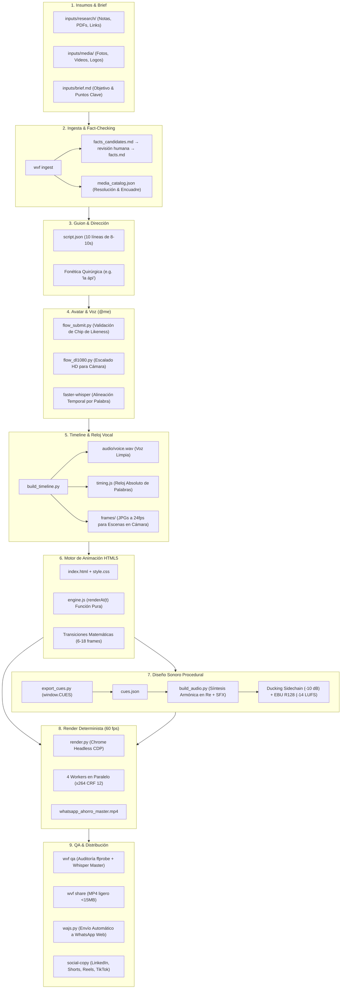

# Video Factory

<div align="center">


-8B5CF6?style=for-the-badge)


<br/>

### Sistema y Entorno de Producción de Video Vertical de Alta Retención
**El estándar operativo de Webres Studio para publicar 3 videos informativos y comerciales por semana con calidad broadcast.**

[Explorador Interactivo del Pipeline (`docs/pipeline_visualizer.html`)](docs/pipeline_visualizer.html) · [Runbook de Agentes (`skills/`)](skills/webres-video-factory/SKILL.md)

</div>

---

## 💡 ¿Qué es Video Factory?

WVF reemplaza los editores de video tradicionales (Premiere, After Effects, CapCut) y la grabación de pantalla en vivo con un **pipeline de código puro, determinista y matemáticamente sincronizado**.

En lugar de arrastrar capas o lidiar con caídas de fotogramas, cada segundo de video se evalúa a través de una función pura:
$$\text{Frame}(t) = \text{renderAt}(t)$$

Esto permite generar videos verticales de **1080×1920 a 60 fps quirúrgicos**, donde los eventos visuales y sonoros se anclan a las marcas temporales de palabras de Whisper. Los timestamps se guardan con tres decimales; esto no garantiza una precisión fonética de 1 ms.

---

## 🏛️ Arquitectura del Pipeline



---

## 🚀 Instalación en Cualquier Mac (60 Segundos)

WVF incluye un instalador idempotente que detecta tu arquitectura (Apple Silicon `arm64` o Intel `x86_64`), configura dependencias vía Homebrew y `uv`, compila el entorno virtual e instala las **7 skills de producción** de forma global para tus agentes de IA.

```bash
git clone https://github.com/webresstudio/video-factory.git
cd video-factory
./install.sh
```

El instalador:
1. Comprueba o instala `ffmpeg` y `uv`.
2. Crea el entorno virtual en `.venv` con librerías científicas (`numpy`, `scipy`, `soundfile`, `faster-whisper`, `playwright`, `pillow`).
3. Descarga el binario Chromium para Playwright.
4. Vincula automáticamente las 7 skills a `~/.gemini/config/skills` y `~/.agents/skills`.
5. Registra el comando global `wvf` en tu terminal (`~/.local/bin/wvf`).

Comprueba que todo esté en orden:
```bash
wvf doctor
```

---

## 👤 Modalidad 1: Para Humanos (Cero Fricción)

Si no quieres lidiar con la terminal ni con comandos técnicos, tu interacción con el agente se reduce a **dos pasos**:

### 1. Pídeselo al Agente en Lenguaje Natural
> *"Haz un video sobre el nuevo cobro de WhatsApp Business API. Mis notas están en Descargas/notas_whatsapp y la gráfica en Descargas/precios.png."*

O simplemente **arrastra los archivos al chat**.

### 2. Dos Puntos Únicos de Aprobación
1. **Aprobación de Guion:** El agente te muestra la tabla de 10 escenas con el texto y la ubicación de tus imágenes. Respondes `"aprobado"` o pides cambios.
2. **Revisión del Video:** El video llega a tu WhatsApp personal. Si notas algún detalle (por ejemplo, una palabra mal pronunciada), lo dices en español cotidiano. Para voz en off, `wvf fix-word` reemplaza la palabra conservando su duración, guarda un respaldo y reconstruye el timeline. En escenas con el presentador visible se regenera la toma completa para conservar la sincronización labial.

---

## 🤖 Modalidad 2: Para Agentes de IA (Matriz CLI `wvf`)

Cualquier agente (Antigravity, Cursor, Claude Code) cuenta con herramientas atómicas para avanzar fase por fase.

```bash
# 1. Inicializar o crear proyecto
wvf new "whatsapp-ahorro" --from ~/Downloads/brief_pack
# O inicializar directamente en la carpeta actual:
# wvf init --client "Acme Corp"

# 2. Gestionar medios (fotos, videos, logos)
wvf media add ~/Downloads/grafica.png ~/Downloads/logo.svg
wvf media list

# 3. Lanzar entorno de producción y vista previa en vivo
wvf start

# 4. Alineación vocal y sincronización temporal
wvf timeline

# 5. Extraer eventos de animación al bus de audio
wvf cues

# 6. Conectar e importar música de FlowMusic (opcional)
wvf flowmusic --status
wvf flowmusic --import ~/Downloads/tech_commercial.mp3

# 7. Generar música armónica / FlowMusic y SFX sintetizados (-14 LUFS con ducking)
wvf audio

# 8. Inspección visual rápida de frames
wvf frames 1.5 7.8 14.2 24.5

# 9. Render final 60 fps determinista por CDP
wvf render --workers 4 --fps 60

# 10. Auditoría técnica y claridad vocal
wvf qa

# 11. Compresión móvil y distribución
wvf share --send-wa --contact "William Romero"

# 12. Corrección quirúrgica de una palabra (e.g. 'API' por 'ápi')
wvf fix-word L01 "API" "la ápi"
```

---

## 🎛️ Configuración de Proyectos por Cliente (`project_config.json`)

Cada cliente o proyecto nuevo puede tener sus propias URLs de trabajo en Google Flow y FlowMusic. Al ejecutar `wvf new`, se genera un archivo `project_config.json` en la raíz del video:

```json
{
  "client_name": "Nombre del Cliente",
  "flow": {
    "project_url": "https://flow.google.com/u/2/project/<id>/edit/<scene_id>",
    "likeness_label": "Yo"
  },
  "flowmusic": {
    "project_url": "https://www.flowmusic.app/project/<id_del_proyecto_del_cliente>",
    "preferred_track": "Tech Commercial",
    "ducking_db": -9.5,
    "use_imported_track": true
  }
}
```

* **`wvf flowmusic --nav`**: Navega automáticamente la pestaña de Google Chrome al proyecto FlowMusic de ese cliente.
* **`wvf flowmusic --import <track.mp3>`**: Convierte el tema a 48kHz estéreo, ajusta la duración con un fundido suave al cierre y activa el ducking inteligente de voz (-10 dB) en `wvf audio`.

---

## 📐 Las 4 Leyes Invariantes de WVF

1. **`renderAt(t)` es una Función Pura:**  
   Prohibido usar `setInterval`, `requestAnimationFrame` en bucle libre o animaciones CSS dependientes de tiempo real. El estado visual completo debe ser deducible únicamente a partir del flotante `t`.
2. **Reloj de Palabras en Milisegundos:**  
   Los eventos visuales se anclan a los timestamps fonéticos generados por `faster-whisper`:
   ```javascript
   const t_cta = W("L10", "automatizamos"); // segundo exacto de la palabra
   ```
3. **Cero Slop en Cifras y Datos:**  
   `wvf ingest` extrae candidatos a `facts_candidates.md`; no realiza verificación externa. Tras confirmar fuentes y fechas, el agente o editor incorpora los hechos a `facts.md`. La ingesta conserva ese archivo, incluso al agregar medios.
4. **Norma Broadcast de Audio:**  
   Objetivo de entrega para streaming, medido mediante **ITU-R BS.1770 / loudnorm**:
   - Integrado: **-14.0 LUFS (±1.0)**
   - Pico Máximo: **≤ -1.0 dBTP**
   - Ducking automático de música: **-8 dB a -10 dB** durante la voz.

---


## Actualización y validación (v0.2.0)

La plantilla incluida es el ejemplo visual de WhatsApp, con un motor completo. Al crear un proyecto se abre una vista previa con tiempos estimados y un aviso de ejemplo. Esos tiempos no se pueden exportar: primero hay que adaptar el guion, verificar sus hechos, generar las tomas y ejecutar `wvf timeline`. Para otros temas, adaptar también `index.html` y los anclajes de `engine.js`.

`wvf init` agrega archivos faltantes y conserva configuración, herramientas y contenido existente. `--force` reemplaza archivos distribuidos por la plantilla y el kit; los archivos personalizados ajenos al kit se conservan. El instalador conserva skills personalizadas existentes.

`wvf qa` devuelve un código distinto de cero si falla resolución, frame rate, codec, canales, volumen o la comparación de la transcripción con el guion. Genera `check/qa_report.json`. `--technical-only` audita únicamente parámetros técnicos; no aprueba claridad vocal. La comparación de palabras no sustituye escuchar y revisar el video.

`wvf share` calcula el bitrate con la duración, hace dos pasadas y comprueba que la salida mida menos de 15 MiB antes de enviar. Con `--send-wa`, WhatsApp Web debe estar abierto en Chrome y el chat seleccionado debe coincidir exactamente con `--contact`. La automatización requiere los permisos y selectores disponibles en esa sesión; los errores se devuelven al CLI.

Para corregir una palabra de voz en off con una toma ya descargada:

```bash
wvf fix-word L01 "API" "la ápi" --patch-file /ruta/parche.mp4 --patch-word "ápi"
wvf audio
wvf render
wvf qa
```

Sin `--patch-file`, se solicita y descarga una toma de Flow. Se usa el proyecto configurado en `project_config.json`; debe estar abierto en Chrome. El parche conserva el intervalo original y la duración total. Si no encuentra la palabra, si la toma requiere un cambio excesivo de velocidad o si la línea muestra al presentador, se detiene sin reemplazar el audio.

Pruebas locales, sin generar clips externos ni enviar mensajes:

```bash
.venv/bin/python -m unittest discover -s tests -v
.venv/bin/python tests/smoke_pipeline.py
.venv/bin/python tests/smoke_repairs.py
```

La integración usa voz sintética de prueba, Chromium/Chrome, FFmpeg y un servidor temporal. Comprueba la vista previa, el timeline, los cues, la mezcla, capturas repetibles, un render real de 30/60 fps, QA y compresión. Los conectores externos se prueban con simulaciones, no con operaciones en cuentas reales.

`WVF_PREVIEW_URL` permite usar un servidor en un puerto diferente a 4391. El comando global `wvf` y las skills enlazadas apuntan al checkout instalado y quedan actualizados al recibir esta versión.

## 📦 Skills de Producción Incluidas

El repositorio incluye y distribuye automáticamente el stack completo de habilidades de diseño de video:

| Skill | Función Clave en WVF |
|---|---|
| `webres-video-factory` | Orquestador maestro del pipeline de 10 fases y control de calidad. |
| `internet-video-2026` | Mecánicas de retención: hook en <1s, re-hooks por cada tip, loops de cierre. |
| `motion-kinetic-typography` | Tipografía suiza sin cajas, íconos Lucide SVG, números tabulares, cero emojis. |
| `dynamic-text-animations` | Revelación por horizonte de máscara, cascada de caracteres, líneas vectoriales finas. |
| `commercial-video-transitions-2026` | Transiciones comerciales de 6 a 18 cuadros (match-cut morphs, knife-edge, scale-punch). |
| `impeccable` | Craft-floor visual: eliminación de tarjetas cliché, jerarquía limpia, micro-interacciones. |
| `social-copy-multichannel-2026` | Copywriting multi-red sin slop para LinkedIn, YouTube Shorts, Reels y TikTok. |

---

## 🔐 Configuración de Permisos en macOS

Para que el agente pueda controlar Google Chrome y WhatsApp Web:
1. **Preferencias del Sistema → Privacidad y Seguridad → Accesibilidad:**  
   Otorga permisos a tu terminal o IDE (Terminal, iTerm, Antigravity).
2. **Preferencias del Sistema → Automatización:**  
   Permite que tu terminal controle `Google Chrome` y `System Events`.

---

<div align="center">

Hecho con precisión técnica para **Webres Studio** · 2026

</div>
